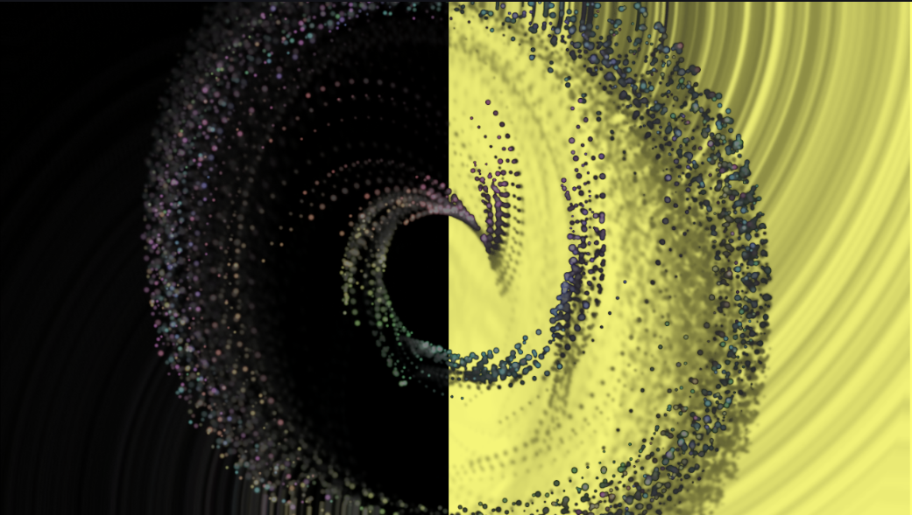
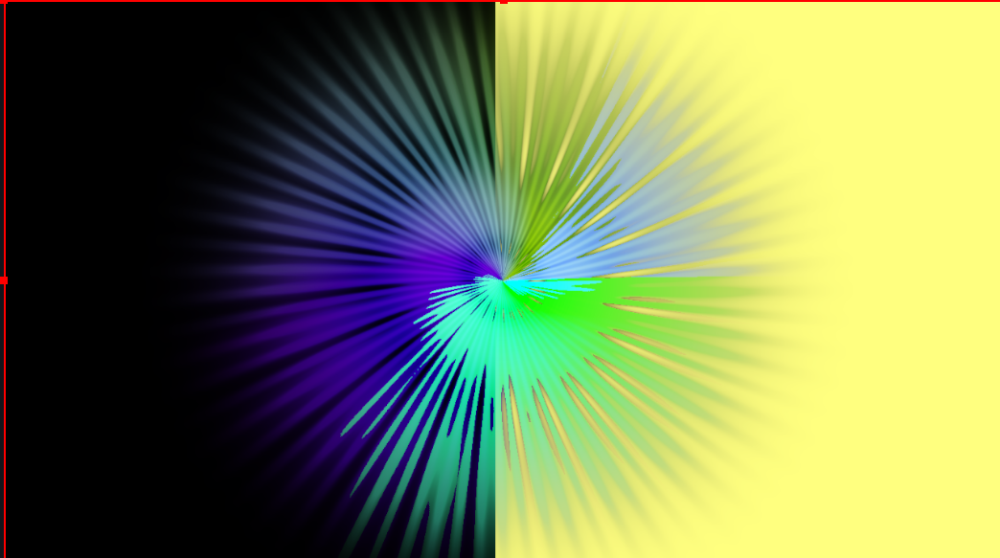
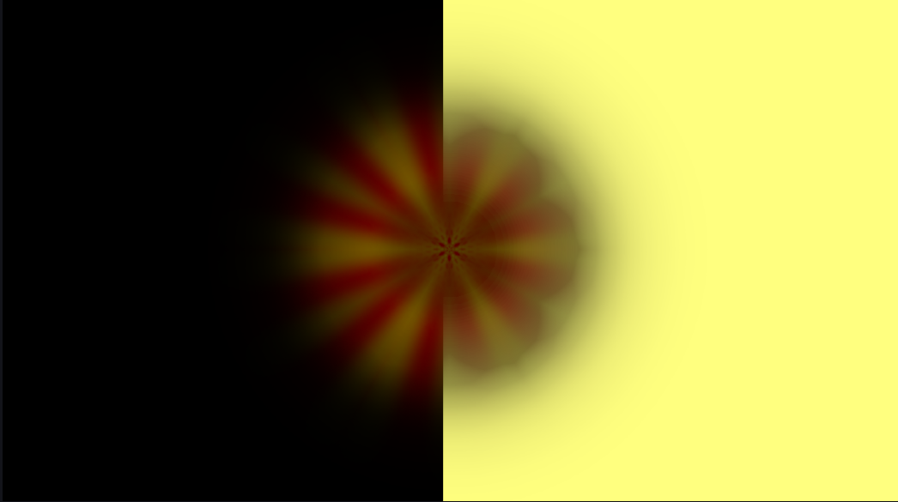
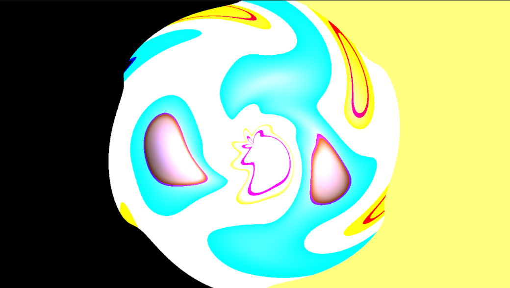
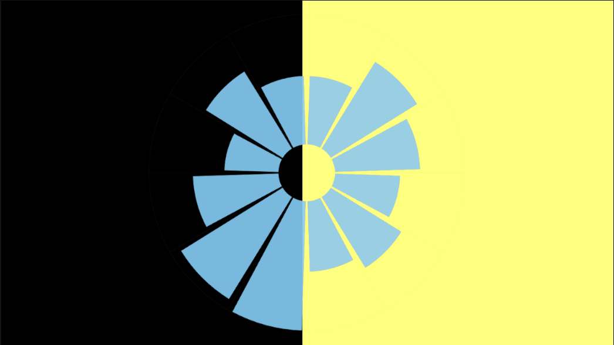
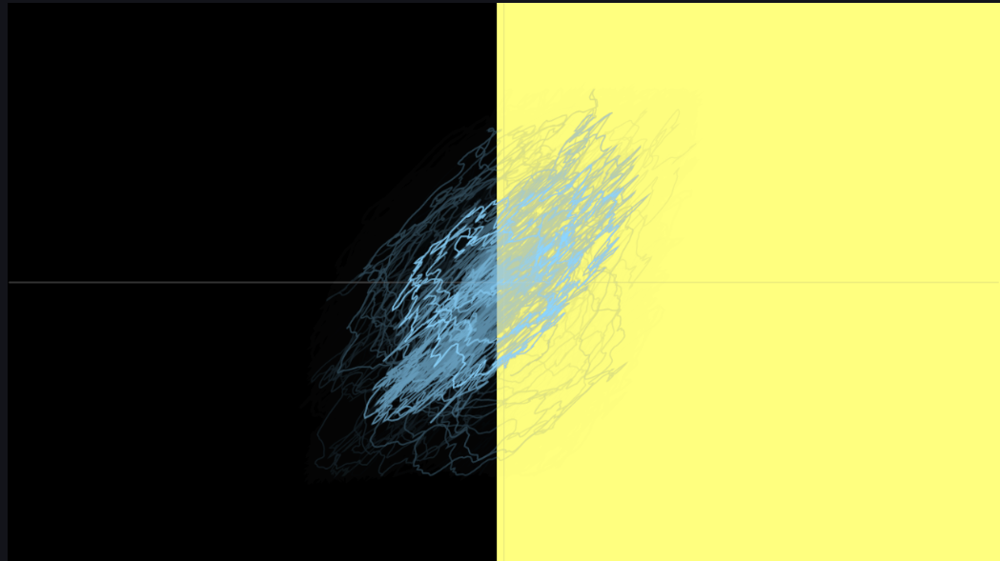
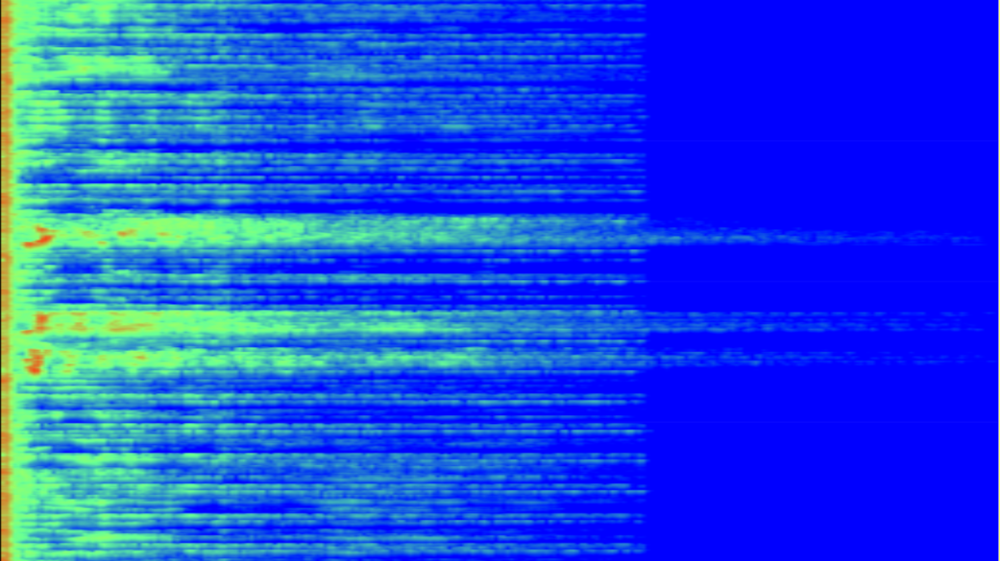
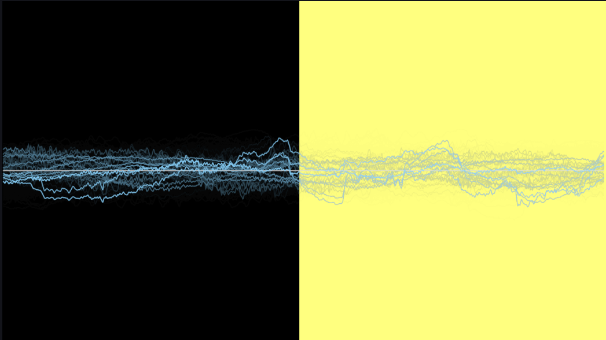
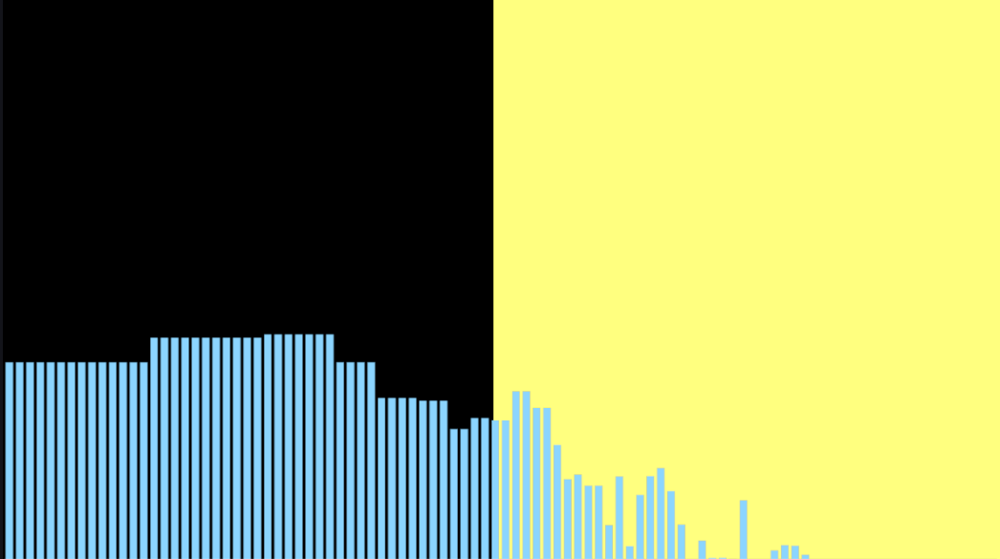

# ObsVizHost (Tray + Localhost Visualizers for OBS)

Tray app that captures **mic input**, computes analysis, and serves a **localhost visualizer page** for OBS Browser Source.

## Install (Windows PowerShell)
```powershell
python -m venv .venv
.\.venv\Scripts\activate
pip install -r requirements.txt
```

## Run
```powershell
python -m app.main
```

A tray icon appears. Use **Open UI** to open the control page, or select visualizers/devices from the tray to change the active visualizer for `/render` clients.

## Audio tuning (tray)
Use the tray menu **Audio Tuning...** to adjust **Gain** (0.2..4.0) and **Visual Smoothing** (0.0..0.95).  
Values persist in `config.json` and apply live, including OBS embed mode.  
The Gain/Smoothing sliders in the visualizer UI are read-only and mirror the tray values.

## OBS Browser Source (stable URL)
Use the stable endpoint so OBS never needs a new URL:
- `http://127.0.0.1:8787/render?embed=1`

Interactive preview:
- `http://127.0.0.1:8787/render`

Direct, fixed visualizer links (no auto-switch):
- `http://127.0.0.1:8787/v/spectrum?embed=1`
- `http://127.0.0.1:8787/v/oscilloscope?embed=1`
- `http://127.0.0.1:8787/v/spectrogram?embed=1`
- `http://127.0.0.1:8787/v/vectorscope?embed=1`
- `http://127.0.0.1:8787/v/chroma?embed=1`
- `http://127.0.0.1:8787/v/plasma?embed=1`
- `http://127.0.0.1:8787/v/feedback?embed=1`
- `http://127.0.0.1:8787/v/tunnel?embed=1`
- `http://127.0.0.1:8787/v/swarm?embed=1`
- `http://127.0.0.1:8787/v/fractal_torus?embed=1`
- `http://127.0.0.1:8787/v/membrane_vortex?embed=1`
- `http://127.0.0.1:8787/v/milkdrop?embed=1`

## Included visualizers Demos

### Particle Swarm / Explosions (WebGL2)


### Tunnel (WebGL)


### Feedback


### Plasma


### Chroma Ring


### Vectorscope


### Spectrogram


### Oscilloscope


### Spectrum


### Additional visualizers (no demo images yet)
- Fractal Torus Tunnel (WebGL)
- Neon Membrane Vortex (WebGL2)
- Milkdrop-ish Warp Reactor (WebGL2)

## Shader credits / attributions
- Fractal Torus Tunnel (WebGL): adapted from Shadertoy shader by bal-khan (MdBczW) - https://www.shadertoy.com/view/MdBczW


## Add a new visualizer
1) Create `static/js/visualizers/myviz.js` exporting a class:
```js
export class MyViz {
  static id = "myviz";
  static name = "My Viz";
  static renderer = "2d"; // or "webgl"
  constructor(canvas){}
  onFrame(frame){}
  destroy(){}
}
```
2) Register it in `static/js/visualizers/registry.js`.
3) (Optional) Add it to `VISUALIZERS` in `app/server.py` to appear in tray menu and index page.
