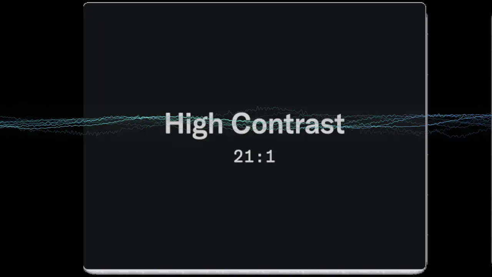
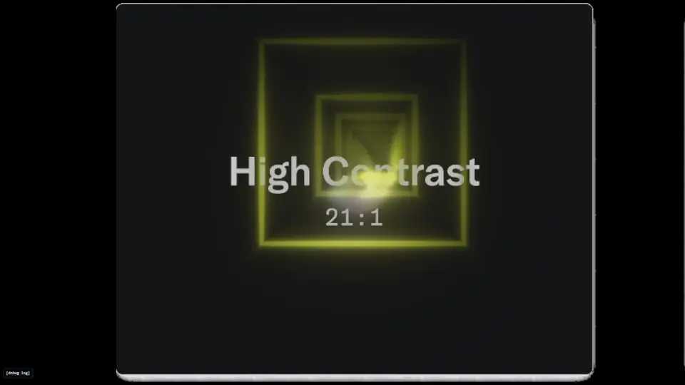

# ObsVizHost (Tray + Localhost Visualizers for OBS)

OBS-focused audio visualizer host (v2-clean rewrite): v2-only registry, Safe Mode Oscilloscope fallback, and a WebGL2 multipass engine.

## Current v2-clean status
- v2-only visualizer list: Safe Mode Oscilloscope (Canvas2D) + WebGL2 multipass (Plasma, Tunnel / Warp Speed, Feedback Mirror).
- Safe Mode Oscilloscope fallback with visible errors and auto-fallback.
- WebGL2 multipass engine (GLSL300, fullscreen triangle, RGBA16F->RGBA8 fallback, feedback ping-pong).
- Plasma/Tunnel/Feedback multipass ports with audio-reactive, overlay-safe alpha.

## Credits / Shader Inspirations
- Original/adapted from: ‘Fractal Toras Tunnel’ by netgrind (2017-05-16) (Shadertoy: https://www.shadertoy.com/view/ld2yDD)
- Inspired by: ‘Disco tunnel’ by WAHa_06x36 (2018-05-08) (Shadertoy: https://www.shadertoy.com/view/XstfzB)

## Getting Started
Install dependencies (Windows PowerShell):
```powershell
python -m venv .venv
.\.venv\Scripts\activate
pip install -r requirements.txt
```

Run the server:
```powershell
python -m app.main
```

Open in a browser:
- http://127.0.0.1:8787/ (control page)
- http://127.0.0.1:8787/render (interactive preview)

OBS Browser Source:
- Overlay: http://127.0.0.1:8787/render?embed=1
- Background: http://127.0.0.1:8787/render

Direct visualizer links:
- http://127.0.0.1:8787/v/safe_canvas2d?embed=1
- http://127.0.0.1:8787/v/plasma?embed=1
- http://127.0.0.1:8787/v/tunnel?embed=1
- http://127.0.0.1:8787/v/feedback?embed=1

## Visualizer previews
<table>
  <tr>
    <th>Safe Mode Oscilloscope (Canvas2D)</th>
    <th>Plasma (WebGL2 Multipass)</th>
  </tr>
  <tr>
    <td></td>
    <td></td>
  </tr>
  <tr>
    <th>Tunnel / Warp Speed (WebGL2 Multipass)</th>
    <th>Feedback Mirror (WebGL2 Multipass)</th>
  </tr>
  <tr>
    <td></td>
    <td></td>
  </tr>
</table>

## Audio tuning (tray)
Use the tray menu Audio Tuning... to adjust Gain (0.2..4.0) and Visual Smoothing (0.0..0.95).
Values persist in config.json and apply live. The Gain/Smoothing sliders in the visualizer UI are read-only and mirror the tray values.

## Guardrails (non-negotiables)
- dt-invariant behavior (decays/advects scale with dt).
- no per-frame allocations in hot paths.
- no per-frame shader compile/link/getUniformLocation.
- no silent error swallowing; failures visible on-screen + console, auto-fallback to Safe Mode.
- overlay-safe alpha by default (no accidental opaque clears).

## Visualizer engine contract
Visualizers are ES modules registered in static/js/visualizers/registry.js with a class implementing:
- constructor(canvas)
- onResize(width, height, dpr) (optional)
- onFrame(frame)
- destroy() (optional)

The host (static/visualizer.html) owns timing and passes a stable frame object each tick. Key fields and units:
- dt (seconds), t (seconds), and time = { t, dt }
- viewport = { w, h, dpr } plus width, height, dpr (backbuffer pixels)
- overlay (true when ?embed=1)
- spectrum, wave, waveLR (smoothed audio arrays, read-only)
- bass, mid, high, energy (0..1 scalars)
- gain, samplerate, fftSize, rms, peak, corr

Do not compute dt from ts; always use frame.dt.

## WebGL2 multipass engine
The multipass engine lives at static/js/webgl/multipass_webgl2.js and supports BufferA/B/C + Image passes.
It is WebGL2-only (GLSL300), uses a fullscreen triangle, caches uniform locations, and falls back from RGBA16F to RGBA8 when needed.
Built-in uniforms include u_time, u_dt, u_frame, u_resolution, u_aspect, audio scalars (u_energy, etc.), and audio textures (u_specTex, u_waveTex).

## Staged plan (v2-clean)
- Stage 1: v2-only registry, Safe Mode Oscilloscope (Canvas2D) fallback, strict error surfacing + auto-fallback.
- Stage 2: WebGL2-only fullscreen triangle multipass engine (GLSL300), BufferA/B/C + Image, optional feedback ping-pong, RGBA16F->RGBA8 fallback, built-in uniforms + audio textures.
- Stage 3: port order: plasma -> tunnel -> feedback (done), next: fractal_torus -> membrane_vortex.
- Stage 4: audio contract cleanup (Python owns smoothing/AGC, add transient/onset scalar).
- Stage 5: categories + compositing policy (overlay vs background, alpha rules).
- Stage 6: hard ones later (Milkdrop fullscreen multipass later; Swarm stays custom until rewritten).

## Troubleshooting
- Errors show in the on-screen error panel and in the browser console.
- Safe Mode activates on any visualizer failure; if you see Safe Mode, check the error panel/console.
- If WebSocket parsing fails, you will see a console error and the error panel will show the cause.

## Demo assets
Demo/ contains the current preview captures used in the README table above.

## Add a new visualizer
- Create a JS module in static/js/visualizers/ exporting a class with static id/name/renderer and the lifecycle methods.
- Register it in static/js/visualizers/registry.js.
- Update VISUALIZERS in app/server.py to keep the server list in sync.
