# ObsVizHost (Tray + Localhost Visualizers for OBS)

Tray app that captures mic input, computes analysis, and serves a localhost visualizer page for OBS Browser Source.

## What it is
- V2-only visualizer host with a tray UI, local control page, and stable /render URL.
- Safe Mode Oscilloscope fallback with on-screen error reporting if a visualizer fails.
- WebGL2 multipass engine for GLSL 300 ES visualizers (fullscreen triangle + audio textures).
- WebGL2 is required for WebGL visualizers; if unavailable the UI shows "WebGL2 required" and falls back to Safe Mode.
- Current visualizers: Safe Mode Oscilloscope (Canvas2D), Vectorscope / Goniometer (Canvas2D), Chroma Ring / Pitch Classes (Canvas2D), Plasma (WebGL2 Multipass), Radial Spectrum (WebGL2 Multipass), Galaxy (Stars by Band) (WebGL2 Multipass), Light-Panel Cube (Audio Tiles) (WebGL2 Multipass), 3D Spectrum Dots (WebGL2 Multipass), Tunnel / Warp Speed (WebGL2 Multipass), Feedback Mirror (WebGL2 Multipass), Apollonian Fractures (WebGL2 Multipass).

## Install (Windows PowerShell)
```powershell
python -m venv .venv
.\.venv\Scripts\activate
pip install -r requirements.txt
```

## Run
```powershell
python -m app.main
```

A tray icon appears. Use Open UI to open the control page, or select visualizers/devices from the tray to change the active visualizer for /render clients.

## OBS Browser Source (stable URL)
Use the stable endpoint so OBS never needs a new URL:
- http://127.0.0.1:8787/render?embed=1

Interactive preview:
- http://127.0.0.1:8787/render

Direct, fixed visualizer links (no auto-switch):
- http://127.0.0.1:8787/v/safe_canvas2d?embed=1
- http://127.0.0.1:8787/v/vectorscope?embed=1
- http://127.0.0.1:8787/v/chroma_ring?embed=1
- http://127.0.0.1:8787/v/plasma?embed=1
- http://127.0.0.1:8787/v/radial_spectrum?embed=1
- http://127.0.0.1:8787/v/galaxy?embed=1
- http://127.0.0.1:8787/v/led_cube?embed=1
- http://127.0.0.1:8787/v/spectrum3d?embed=1
- http://127.0.0.1:8787/v/tunnel?embed=1
- http://127.0.0.1:8787/v/feedback?embed=1
- http://127.0.0.1:8787/v/apollonian_fractures?embed=1

## Audio tuning (tray)
Use the tray menu Audio Tuning... to adjust Gain (0.2-4.0) and Visual Smoothing (0.0-0.95).
Values persist in config.json and apply live, including OBS embed mode.
The Gain/Smoothing sliders in the visualizer UI are read-only and mirror the tray values.

## Demos (V2)
**Safe Mode Oscilloscope (Canvas2D)** - fallback waveform preview with overlay-safe output.
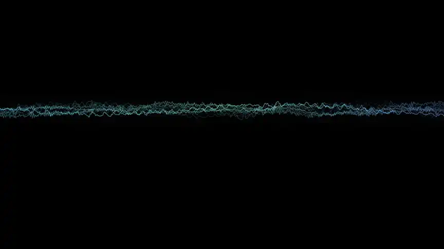

**Vectorscope / Goniometer (Canvas2D)** - stereo phase and correlation display.
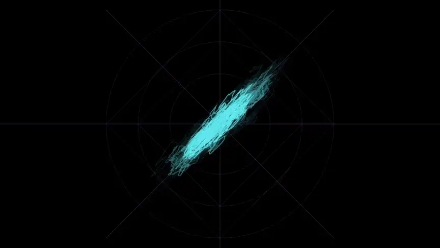

**Chroma Ring / Pitch Classes (Canvas2D)** - pitch-class energy ring from the spectrum.
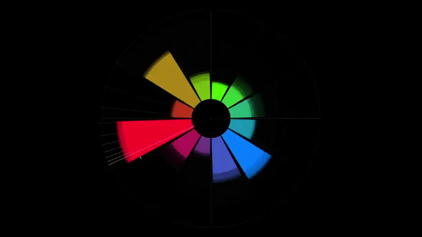

**Plasma (WebGL2 Multipass)** - layered plasma with audio-reactive glow.
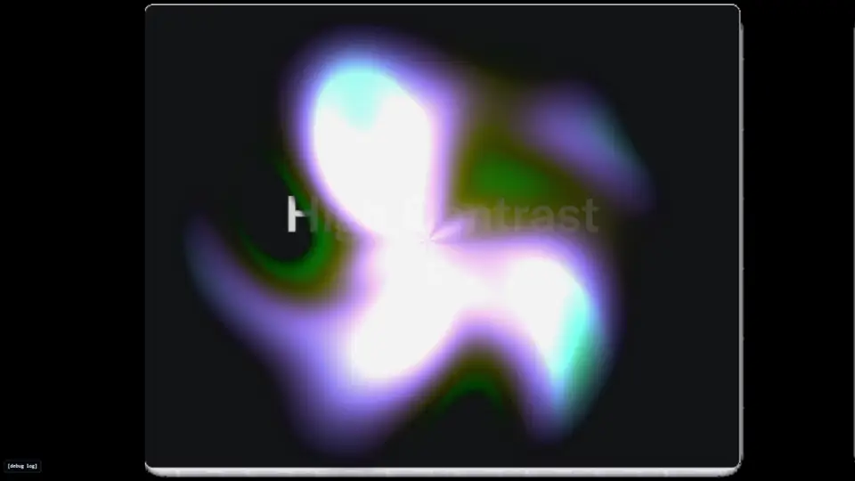

**Radial Spectrum (WebGL2 Multipass)** - circular spectrum bars with peak hats.
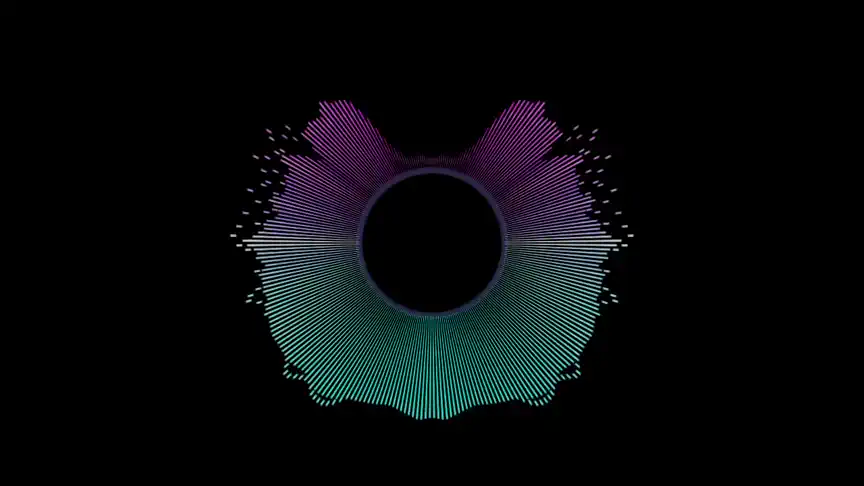

**Galaxy (Stars by Band) (WebGL2 Multipass)** - nebula and starfield driven by band energy.
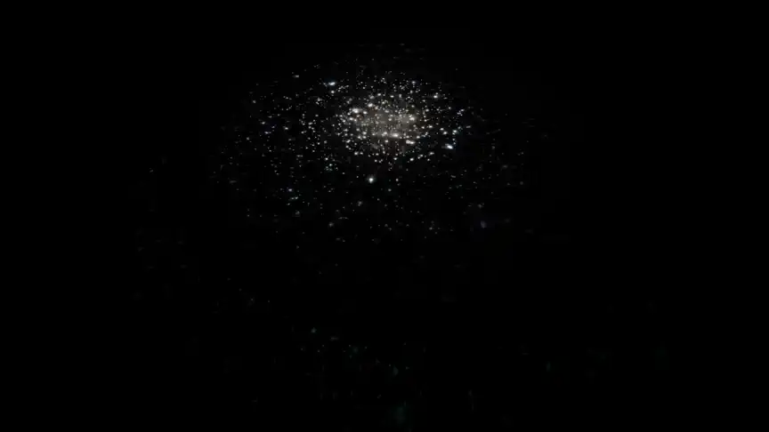

**Light-Panel Cube (Audio Tiles) (WebGL2 Multipass)** - LED tile cube with spectrum-mapped faces.
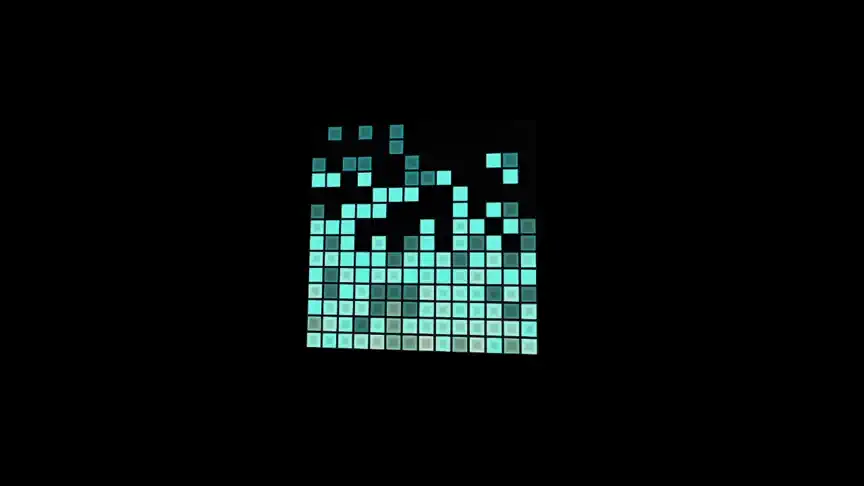

**3D Spectrum Dots (WebGL2 Multipass)** - 3D band field rendered as dots.
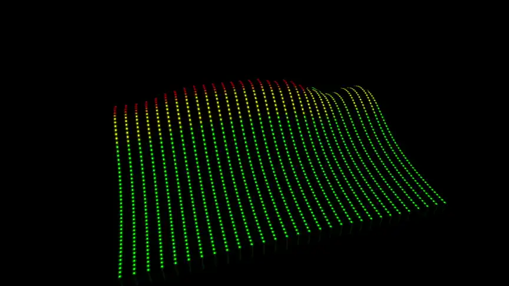

**Tunnel / Warp Speed (WebGL2 Multipass)** - forward tunnel with audio-driven speed.
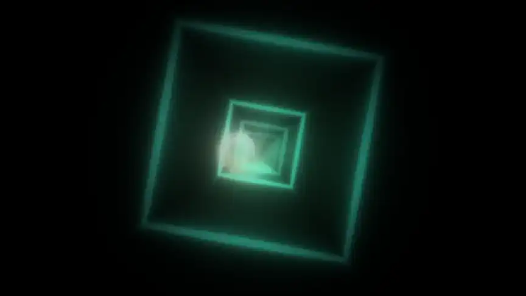

**Feedback Mirror (WebGL2 Multipass)** - recursive feedback with mirrored motion.
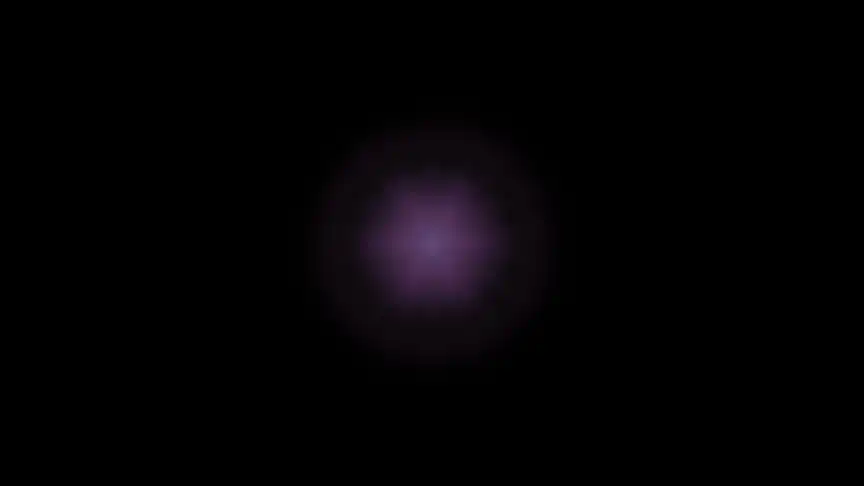

**Apollonian Fractures (WebGL2 Multipass)** - audio-reactive apollonian fractal with warp and ring shimmer.
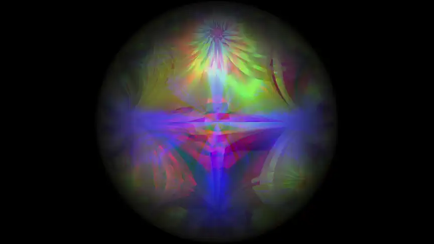

## Credits / attributions
- Tunnel / Warp Speed (WebGL2 Multipass): inspired by Shadertoy shader "Disco tunnel" by WAHa_06x36 (2018-05-08) https://www.shadertoy.com/view/XstfzB
- Radial Spectrum (WebGL2 Multipass): inspired by Shadertoy shader "Radial Audio Visualizer" by Rafbeam (2018-04-21) https://www.shadertoy.com/view/ldtBRN
- 3D Spectrum Dots (WebGL2 Multipass): inspired by Shadertoy shader "Video Heightfield" (audio heightfield variant) by huttarl (2013-03-20); https://www.shadertoy.com/view/ldXGzN
- Light-Panel Cube (Audio Tiles) (WebGL2 Multipass): inspired by "Fork 3D Audio V ItsAlmostP 974" by ItsAlmostPG (2023-06-04) https://www.shadertoy.com/view/dt3XDl
- Apollonian Fractures (WebGL2 Multipass): original Shadertoy "Apollonian Fractures" by otaviogood (2014-09-08) https://www.shadertoy.com/view/XdjSzD

## Creating Visualizers

### File locations
- Create your visualizer module in: static/js/visualizers/
- Register it in: static/js/visualizers/registry.js
- Optional (recommended): add it to the tray list in app/server.py (VISUALIZERS)

### Visualizer contract
- Required: static id, static name, static renderer ("2d" or "webgl")
- Lifecycle: constructor(canvas), onFrame(frame), optional onResize(w,h,dpr), optional destroy()
- static/visualizer.html owns the render loop and calls onFrame(frame)

### Key frame fields
- dt, t
- spectrum, wave, waveLR
- energy, bass, mid, high
- width, height, dpr, overlay

### Canvas2D template
```js
export class MyCanvasViz {
  static id = "my_canvas";
  static name = "My Canvas Viz";
  static renderer = "2d";

  constructor(canvas) {
    this.canvas = canvas;
    this.ctx = canvas.getContext("2d");
    this.phase = 0;
  }

  onResize(w, h, dpr) {
    const cw = Math.max(1, Math.floor(w * dpr));
    const ch = Math.max(1, Math.floor(h * dpr));
    this.canvas.width = cw;
    this.canvas.height = ch;
    this.ctx.setTransform(dpr, 0, 0, dpr, 0, 0);
  }

  onFrame(frame) {
    this.phase += frame.dt;
    const ctx = this.ctx;
    ctx.clearRect(0, 0, frame.width, frame.height);

    const wave = frame.wave;
    if (!wave || wave.length < 2) return;

    ctx.beginPath();
    for (let i = 0; i < wave.length; i++) {
      const x = (i / (wave.length - 1)) * frame.width;
      const y = (0.5 - 0.4 * wave[i]) * frame.height;
      if (i === 0) ctx.moveTo(x, y);
      else ctx.lineTo(x, y);
    }
    const a = 0.6 + 0.2 * Math.sin(this.phase * 2.0);
    ctx.strokeStyle = `rgba(0, 255, 255, ${a})`;
    ctx.stroke();
  }
}
```

### WebGL2 multipass template
```js
import { MultiPassWebGL2 } from "/static/js/webgl/multipass_webgl2.js";

const FS = `#version 300 es
precision highp float;

in vec2 v_uv;
out vec4 fragColor;

uniform float u_time;
uniform float u_dt;

void main(){
  float pulse = 0.5 + 0.5 * sin(u_time * 2.0);
  fragColor = vec4(vec3(pulse), 0.6);
}
`;

const PASS_SPECS = [
  { name: "Image", fs: FS },
];

export class MyWebGLViz {
  static id = "my_webgl";
  static name = "My WebGL Viz";
  static renderer = "webgl";

  constructor(canvas) {
    this.canvas = canvas;
    const gl = canvas.getContext("webgl2", {
      alpha: true,
      antialias: false,
      premultipliedAlpha: false,
      preserveDrawingBuffer: false,
    });
    if (!gl) throw new Error("WebGL2 not available");
    this.mp = new MultiPassWebGL2(gl);
    this.mp.setPasses(PASS_SPECS);
    this._frame = 0;
  }

  onResize(w, h, dpr) {
    this.mp.setSize(w, h, dpr);
  }

  onFrame(frame) {
    const t = (frame && frame.t) || (frame && frame.time && frame.time.t) || 0;
    const dt = (frame && frame.dt) || (frame && frame.time && frame.time.dt) || 0;
    const frameIndex = frame && frame.frameId ? frame.frameId : (this._frame = (this._frame + 1) | 0);
    this.mp.render(frame, t, dt, frameIndex);
  }

  destroy() {
    this.mp.destroy();
  }
}
```

### WebGL2 multipass shader notes
- Use GLSL 300 es: `#version 300 es`, `in vec2 v_uv;`, `out vec4 fragColor;`
- Built-in uniforms you can rely on include `u_time` and `u_dt`
